<!-- ═══════════════════════════ HEADER ═══════════════════════════ -->
<div align="center">


<a href="https://github.com/ashrithBalaji456/Code_Testing_And_Debugging_Platform">
  
</a>

<br/>


<br/>

**A next-generation developer workbench that streamlines code quality audits, real-time debugging with root-cause diagnostics, and unit test generation, all inside your browser.**

<br/>

[✨ Features](#-key-features) •
[🏗 Architecture](#-system-architecture) •
[🔄 Workflows](#-workflow-charts) •
[📊 Charts](#-data-charts--analytics) •
[🚀 Quick Start](#-getting-started) •
[🗺 Roadmap](#-roadmap) •
[🤝 Contributing](#-contributing)

</div>

---

## 📑 Table of Contents

<details open>
<summary><b>Click to expand / collapse</b></summary>

1. [Overview](#-overview)
2. [Key Features](#-key-features)
3. [Tech Stack](#-tech-stack)
4. [System Architecture](#-system-architecture)
5. [Workflow Charts](#-workflow-charts)
6. [Data Charts & Analytics](#-data-charts--analytics)
7. [Project Structure](#-project-structure)
8. [Getting Started](#-getting-started)
9. [Usage Guide](#-usage-guide)
10. [Available Scripts](#-available-scripts)
11. [Configuration (Optional Gemini AI)](#-configuration-optional-gemini-ai)
12. [Roadmap](#-roadmap)
13. [Contributing](#-contributing)
14. [FAQ](#-faq)
15. [License & Author](#-license--author)

</details>

---

## 🌟 Overview

**DevPulse Studio** brings the three most time-consuming parts of everyday development into one interface:

| 🔍 Review | 🐞 Debug | 🧪 Test |
|:---:|:---:|:---:|
| Score your code, find vulnerabilities and smells, apply one-click fixes | Trap runtime errors, understand the *why*, step through execution | Generate and run unit tests, export to Jest / Vitest |

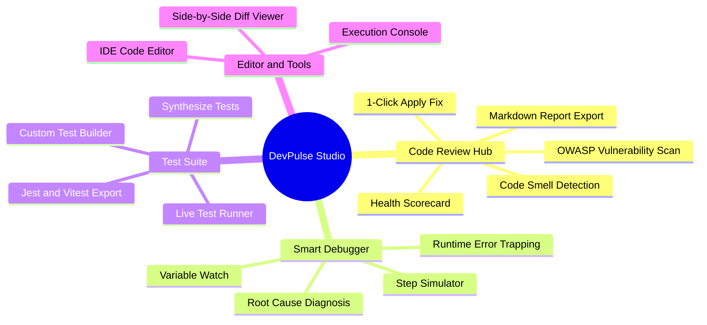
```mermaid
mindmap
  root((DevPulse Studio))
    Code Review Hub
      Health Scorecard
      OWASP Vulnerability Scan
      Code Smell Detection
      1-Click Apply Fix
      Markdown Report Export
    Smart Debugger
      Runtime Error Trapping
      Root Cause Diagnosis
      Variable Watch
      Step Simulator
    Test Suite
      Live Test Runner
      Synthesize Tests
      Custom Test Builder
      Jest and Vitest Export
    Editor and Tools
      IDE Code Editor
      Side-by-Side Diff Viewer
      Execution Console
```

---

## ✨ Key Features

### 🔍 1. Automated Code Review Hub

- **Health & Quality Scorecard**: overall letter grade (**A+ to F**), Security Score, Performance Index and Code Quality metrics.
- **Vulnerability & Smell Detection**: audits OWASP-style flaws (SQL injection, hardcoded secrets, unsafe `eval()`), quadratic `O(N²)` nested loops, unhandled recursion, memory leaks and missing input validation.
- **1-Click Auto Patch**: every issue card has an **Apply Fix** button that patches the faulty lines directly in the editor.
- **Exportable Reports**: download a Markdown report for pull-request reviews.

### 🐞 2. Smart Debugger & Root Cause Analyzer

- **Runtime Error Trapping**: catches uncaught exceptions and stack traces in a safe in-browser sandbox.
- **Root Cause Diagnosis**: explains *why* a bug happened (call-stack overflow, null dereference, off-by-one) and gives actionable remediation.
- **Variable Watch & Step Simulator**: step forward, backward or auto-play through execution frames while inspecting local state.

### 🧪 3. Test Suite & Assertion Runner

- **Live Test Runner**: evaluates unit tests against the current editor code, with latency and pass/fail indicators.
- **Synthesize Tests**: infers function signatures and generates happy-path, boundary and edge-case assertions.
- **Custom Test Builder**: add arguments, expected values and categories through an interactive modal.
- **Jest / Vitest Exporter**: export the whole suite as a standard test script.

### ⚡ 4. Code Editor, Diff Viewer & Terminal

- **IDE Code Editor**: line-number gutter with error/warning markers, tab indentation, active-line highlight.
- **Side-by-Side Diff Viewer**: compare buggy code to the refactored version, with an **Apply All Fixes** action.
- **Execution Console**: integrated terminal showing logs, warnings, errors and execution latency.

---

## 🛠 Tech Stack

<div align="center">


</div>

| Layer | Technology | Purpose |
|:--|:--|:--|
| **Frontend** | React 19, Vite | UI components and lightning-fast dev server / bundler |
| **Icons** | Lucide React | Consistent, lightweight icon set |
| **Styling** | Vanilla CSS Design System | Dark IDE theme with glassmorphism |
| **Engines** | Static heuristic review engine | Rule-based code analysis |
| | Safe evaluation sandbox | Isolated in-browser code execution |
| | Assertion runner | Executes generated and custom tests |
| | Gemini AI (optional) | AI-assisted review and diagnostics |
| **Linting** | Oxlint (`.oxlintrc.json`) | Fast code linting |

---

## 🏗 System Architecture

### High-Level Architecture

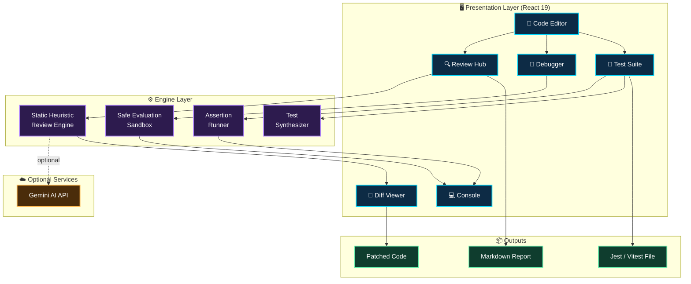
```mermaid
flowchart TB
    subgraph UI["🖥 Presentation Layer (React 19)"]
        direction LR
        E["📝 Code Editor"]
        R["🔍 Review Hub"]
        D["🐞 Debugger"]
        T["🧪 Test Suite"]
        V["🔀 Diff Viewer"]
        C["💻 Console"]
    end

    subgraph ENG["⚙️ Engine Layer"]
        direction LR
        H["Static Heuristic<br/>Review Engine"]
        S["Safe Evaluation<br/>Sandbox"]
        A["Assertion<br/>Runner"]
        G["Test<br/>Synthesizer"]
    end

    subgraph EXT["☁️ Optional Services"]
        AI["Gemini AI API"]
    end

    subgraph OUT["📦 Outputs"]
        direction LR
        MD["Markdown Report"]
        JT["Jest / Vitest File"]
        PF["Patched Code"]
    end

    E --> R & D & T
    R --> H
    D --> S
    T --> A
    T --> G
    H -. optional .-> AI
    H --> V
    S --> C
    A --> C
    V --> PF
    R --> MD
    T --> JT

    classDef ui fill:#0d2b45,stroke:#00d9ff,color:#fff,stroke-width:2px
    classDef eng fill:#2d1b4e,stroke:#b388ff,color:#fff,stroke-width:2px
    classDef ext fill:#4a2c0a,stroke:#ffb74d,color:#fff,stroke-width:2px
    classDef out fill:#0f3d2e,stroke:#69f0ae,color:#fff,stroke-width:2px
    class E,R,D,T,V,C ui
    class H,S,A,G eng
    class AI ext
    class MD,JT,PF out
```

### Component Relationships

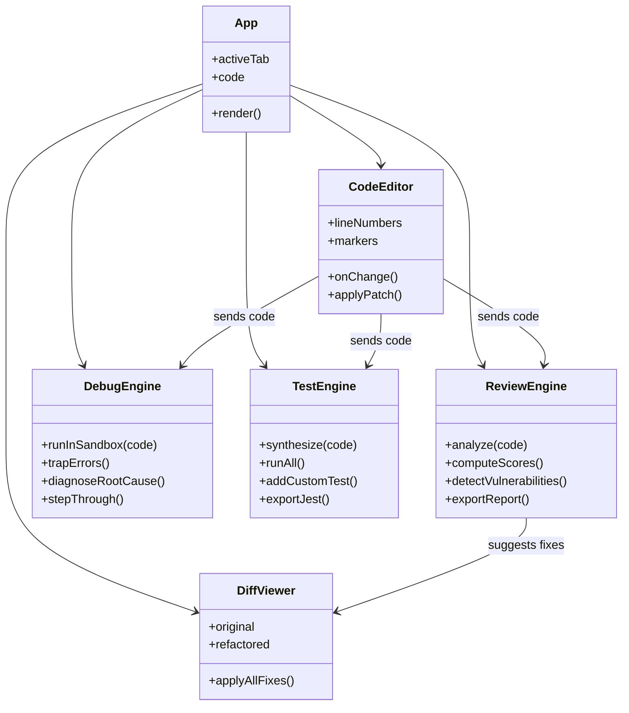
```mermaid
classDiagram
    class App {
        +activeTab
        +code
        +render()
    }
    class CodeEditor {
        +lineNumbers
        +markers
        +onChange()
        +applyPatch()
    }
    class ReviewEngine {
        +analyze(code)
        +computeScores()
        +detectVulnerabilities()
        +exportReport()
    }
    class DebugEngine {
        +runInSandbox(code)
        +trapErrors()
        +diagnoseRootCause()
        +stepThrough()
    }
    class TestEngine {
        +synthesize(code)
        +runAll()
        +addCustomTest()
        +exportJest()
    }
    class DiffViewer {
        +original
        +refactored
        +applyAllFixes()
    }
    App --> CodeEditor
    App --> ReviewEngine
    App --> DebugEngine
    App --> TestEngine
    App --> DiffViewer
    ReviewEngine --> DiffViewer : suggests fixes
    CodeEditor --> ReviewEngine : sends code
    CodeEditor --> DebugEngine : sends code
    CodeEditor --> TestEngine : sends code
```

---

## 🔄 Workflow Charts

### 1️⃣ Master Application Workflow

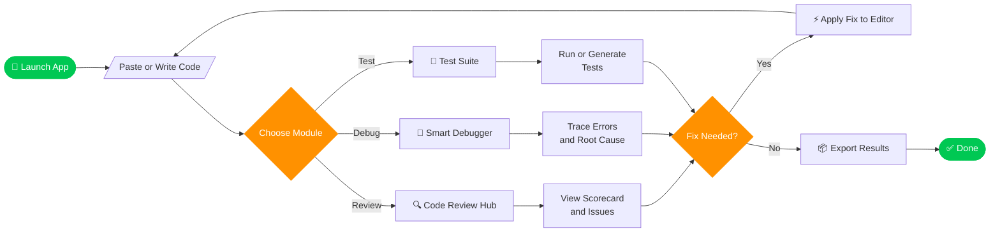
```mermaid
flowchart LR
    A([🚀 Launch App]) --> B[/Paste or Write Code/]
    B --> C{Choose Module}
    C -->|Review| D[🔍 Code Review Hub]
    C -->|Debug| E[🐞 Smart Debugger]
    C -->|Test| F[🧪 Test Suite]
    D --> G[View Scorecard<br/>and Issues]
    E --> H[Trace Errors<br/>and Root Cause]
    F --> I[Run or Generate<br/>Tests]
    G --> J{Fix Needed?}
    H --> J
    I --> J
    J -->|Yes| K[⚡ Apply Fix to Editor]
    J -->|No| L[📦 Export Results]
    K --> B
    L --> M([✅ Done])

    style A fill:#00c853,color:#fff,stroke:#00c853
    style M fill:#00c853,color:#fff,stroke:#00c853
    style C fill:#ff9100,color:#fff,stroke:#ff9100
    style J fill:#ff9100,color:#fff,stroke:#ff9100
```

### 2️⃣ Code Review Workflow

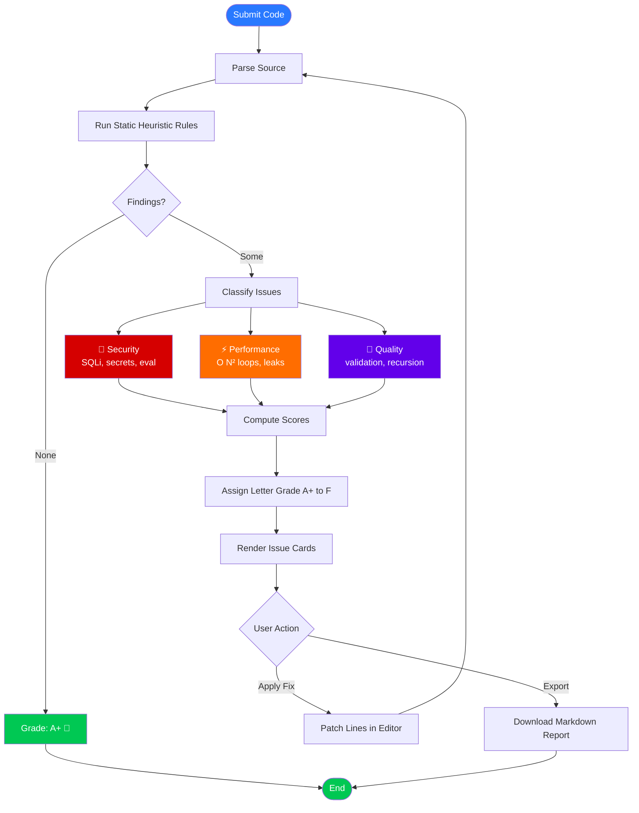
```mermaid
flowchart TD
    A([Submit Code]) --> B[Parse Source]
    B --> C[Run Static Heuristic Rules]
    C --> D{Findings?}
    D -->|None| E[Grade: A+ 🎉]
    D -->|Some| F[Classify Issues]
    F --> G[🔐 Security<br/>SQLi, secrets, eval]
    F --> H[⚡ Performance<br/>O N² loops, leaks]
    F --> I[🧹 Quality<br/>validation, recursion]
    G --> J[Compute Scores]
    H --> J
    I --> J
    J --> K[Assign Letter Grade A+ to F]
    K --> L[Render Issue Cards]
    L --> M{User Action}
    M -->|Apply Fix| N[Patch Lines in Editor]
    M -->|Export| O[Download Markdown Report]
    N --> B
    E --> P([End])
    O --> P

    style A fill:#2979ff,color:#fff
    style E fill:#00c853,color:#fff
    style P fill:#00c853,color:#fff
    style G fill:#d50000,color:#fff
    style H fill:#ff6d00,color:#fff
    style I fill:#6200ea,color:#fff
```

### 3️⃣ Debugging Workflow

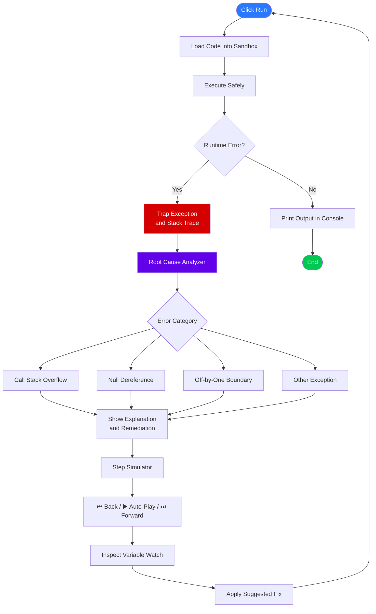
```mermaid
flowchart TD
    A([Click Run]) --> B[Load Code into Sandbox]
    B --> C[Execute Safely]
    C --> D{Runtime Error?}
    D -->|No| E[Print Output in Console]
    D -->|Yes| F[Trap Exception<br/>and Stack Trace]
    F --> G[Root Cause Analyzer]
    G --> H{Error Category}
    H --> H1[Call Stack Overflow]
    H --> H2[Null Dereference]
    H --> H3[Off-by-One Boundary]
    H --> H4[Other Exception]
    H1 --> I[Show Explanation<br/>and Remediation]
    H2 --> I
    H3 --> I
    H4 --> I
    I --> J[Step Simulator]
    J --> K[⏮ Back / ▶ Auto-Play / ⏭ Forward]
    K --> L[Inspect Variable Watch]
    L --> M[Apply Suggested Fix]
    M --> A
    E --> N([End])

    style A fill:#2979ff,color:#fff
    style F fill:#d50000,color:#fff
    style G fill:#6200ea,color:#fff
    style N fill:#00c853,color:#fff
```

### 4️⃣ Test Generation & Execution Workflow

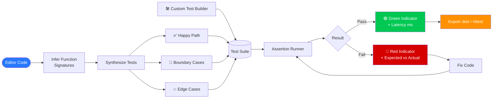
```mermaid
flowchart LR
    A([Editor Code]) --> B[Infer Function<br/>Signatures]
    B --> C[Synthesize Tests]
    C --> D[✅ Happy Path]
    C --> E[🚧 Boundary Cases]
    C --> F[💥 Edge Cases]
    G[🛠 Custom Test Builder] --> H
    D --> H[(Test Suite)]
    E --> H
    F --> H
    H --> I[Assertion Runner]
    I --> J{Result}
    J -->|Pass| K[🟢 Green Indicator<br/>+ Latency ms]
    J -->|Fail| L[🔴 Red Indicator<br/>+ Expected vs Actual]
    K --> M[Export Jest / Vitest]
    L --> N[Fix Code]
    N --> I

    style A fill:#2979ff,color:#fff
    style K fill:#00c853,color:#fff
    style L fill:#d50000,color:#fff
    style M fill:#ff9100,color:#fff
```

### 5️⃣ End-to-End Sequence (User ↔ System)

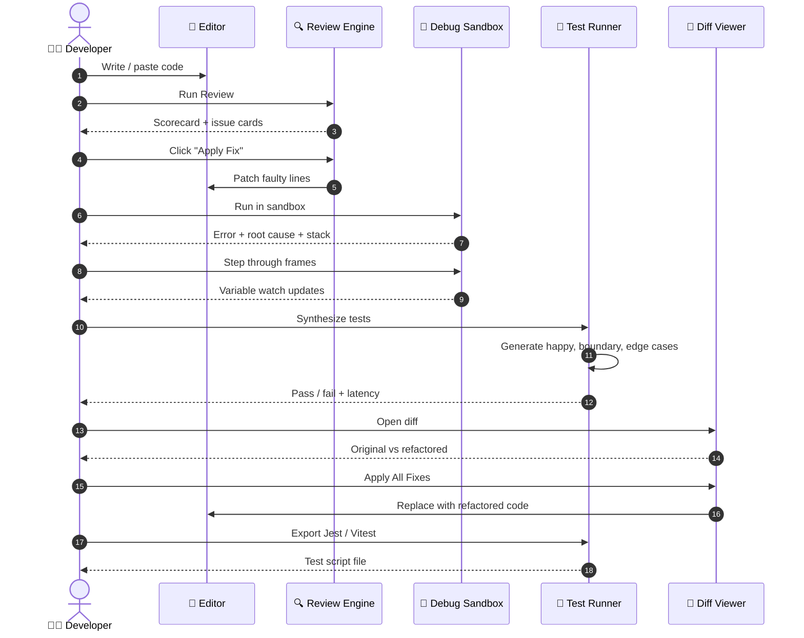
```mermaid
sequenceDiagram
    autonumber
    actor Dev as 👨‍💻 Developer
    participant ED as 📝 Editor
    participant RV as 🔍 Review Engine
    participant DB as 🐞 Debug Sandbox
    participant TS as 🧪 Test Runner
    participant DF as 🔀 Diff Viewer

    Dev->>ED: Write / paste code
    Dev->>RV: Run Review
    RV-->>Dev: Scorecard + issue cards
    Dev->>RV: Click "Apply Fix"
    RV->>ED: Patch faulty lines
    Dev->>DB: Run in sandbox
    DB-->>Dev: Error + root cause + stack
    Dev->>DB: Step through frames
    DB-->>Dev: Variable watch updates
    Dev->>TS: Synthesize tests
    TS->>TS: Generate happy, boundary, edge cases
    TS-->>Dev: Pass / fail + latency
    Dev->>DF: Open diff
    DF-->>Dev: Original vs refactored
    Dev->>DF: Apply All Fixes
    DF->>ED: Replace with refactored code
    Dev->>TS: Export Jest / Vitest
    TS-->>Dev: Test script file
```

### 6️⃣ Application State Machine

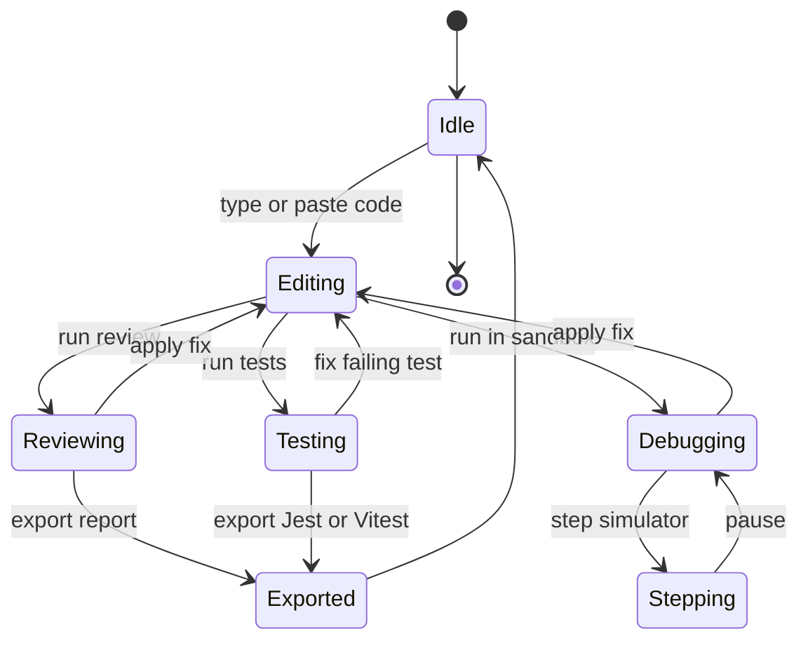
```mermaid
stateDiagram-v2
    [*] --> Idle
    Idle --> Editing: type or paste code
    Editing --> Reviewing: run review
    Editing --> Debugging: run in sandbox
    Editing --> Testing: run tests
    Reviewing --> Editing: apply fix
    Reviewing --> Exported: export report
    Debugging --> Stepping: step simulator
    Stepping --> Debugging: pause
    Debugging --> Editing: apply fix
    Testing --> Editing: fix failing test
    Testing --> Exported: export Jest or Vitest
    Exported --> Idle
    Idle --> [*]
```

### 7️⃣ Developer Git Workflow

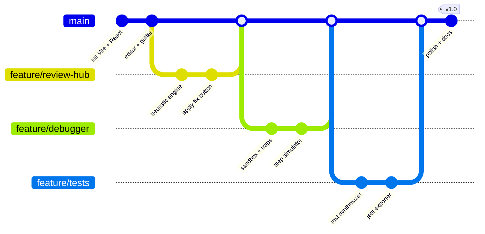
```mermaid
gitGraph
    commit id: "init Vite + React"
    commit id: "editor + gutter"
    branch feature/review-hub
    checkout feature/review-hub
    commit id: "heuristic engine"
    commit id: "apply fix button"
    checkout main
    merge feature/review-hub
    branch feature/debugger
    checkout feature/debugger
    commit id: "sandbox + traps"
    commit id: "step simulator"
    checkout main
    merge feature/debugger
    branch feature/tests
    checkout feature/tests
    commit id: "test synthesizer"
    commit id: "jest exporter"
    checkout main
    merge feature/tests
    commit id: "polish + docs" tag: "v1.0"
```

> 📝 *The Git graph above illustrates the typical feature-branch flow for contributors. It is a guide, not the repo's literal history.*

---

## 📊 Data Charts & Analytics

> 💡 **Note:** The charts below are **illustrative samples** showing what DevPulse Studio's scorecard and analytics represent. The numbers are example data, not live measurements.

### 🥧 Issue Distribution by Category (Sample Review)

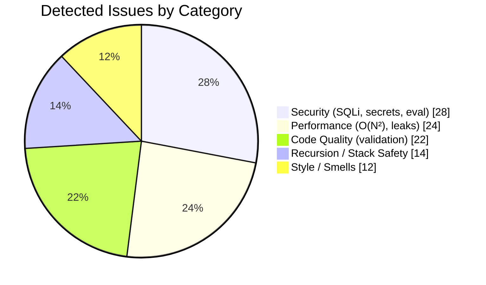
```mermaid
pie showData title Detected Issues by Category
    "Security (SQLi, secrets, eval)" : 28
    "Performance (O(N²), leaks)" : 24
    "Code Quality (validation)" : 22
    "Recursion / Stack Safety" : 14
    "Style / Smells" : 12
```

### 📈 Score Trend: Before vs After Auto-Fix


```mermaid
xychart-beta
    title "Quality Scores Before and After Applying Fixes"
    x-axis ["Security", "Performance", "Quality", "Overall"]
    y-axis "Score (0-100)" 0 --> 100
    bar [42, 55, 60, 52]
    bar [94, 88, 91, 91]
```

> 🟦 First bar = **before fixes** • 🟧 second bar = **after fixes**

### 📉 Review Score Improvement Across Iterations

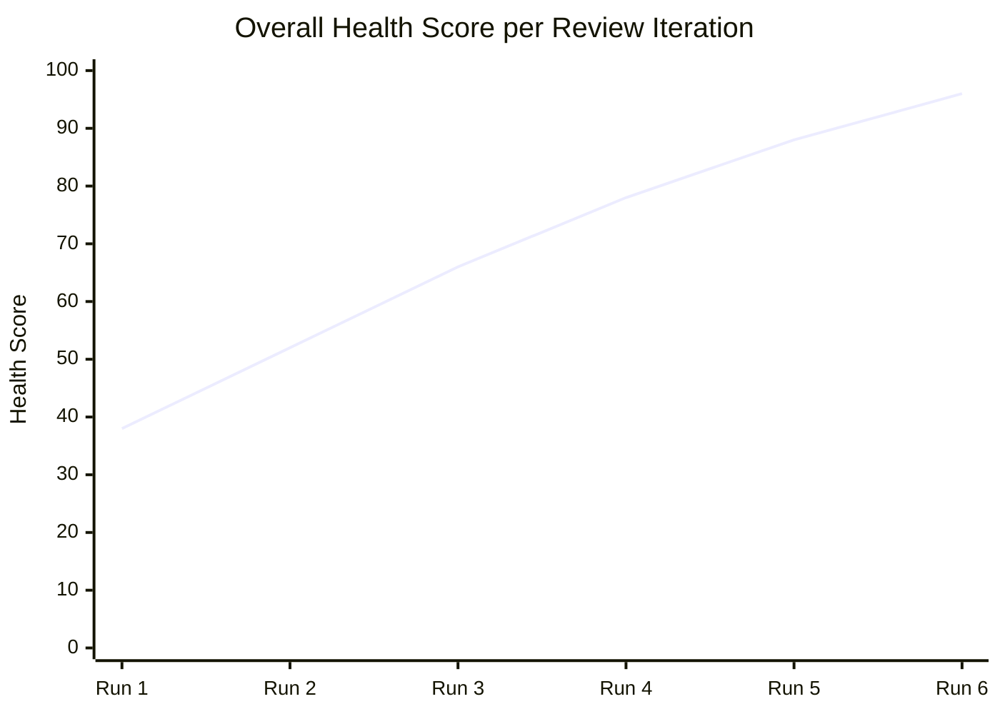
```mermaid
xychart-beta
    title "Overall Health Score per Review Iteration"
    x-axis ["Run 1", "Run 2", "Run 3", "Run 4", "Run 5", "Run 6"]
    y-axis "Health Score" 0 --> 100
    line [38, 52, 66, 78, 88, 96]
```

### ⏱ Test Execution Latency (ms) by Test Type

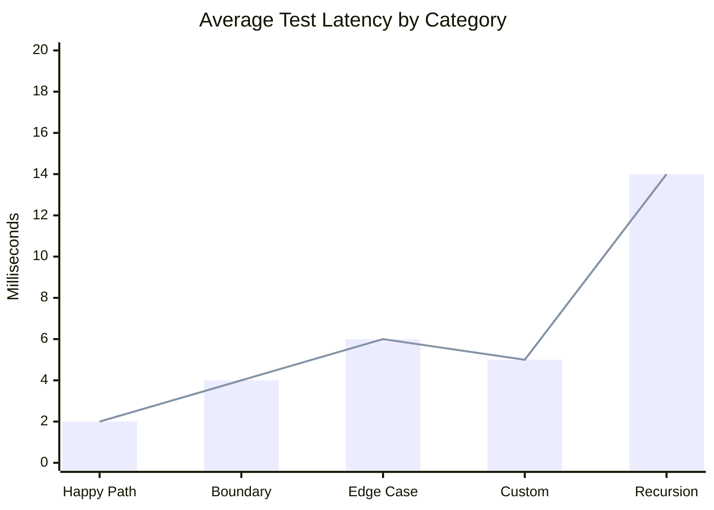
```mermaid
xychart-beta
    title "Average Test Latency by Category"
    x-axis ["Happy Path", "Boundary", "Edge Case", "Custom", "Recursion"]
    y-axis "Milliseconds" 0 --> 20
    bar [2, 4, 6, 5, 14]
    line [2, 4, 6, 5, 14]
```

### 🧪 Test Result Breakdown

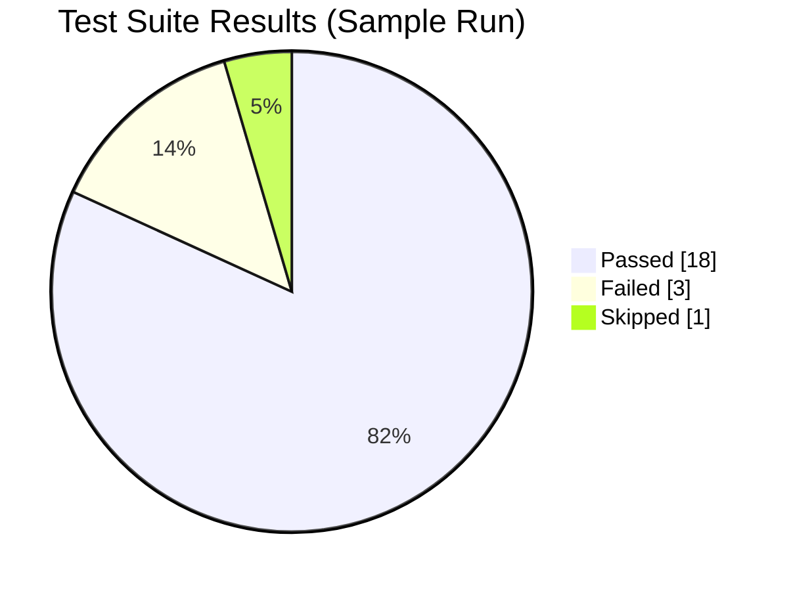
```mermaid
pie showData title Test Suite Results (Sample Run)
    "Passed" : 18
    "Failed" : 3
    "Skipped" : 1
```

### 🐞 Common Root Causes Diagnosed

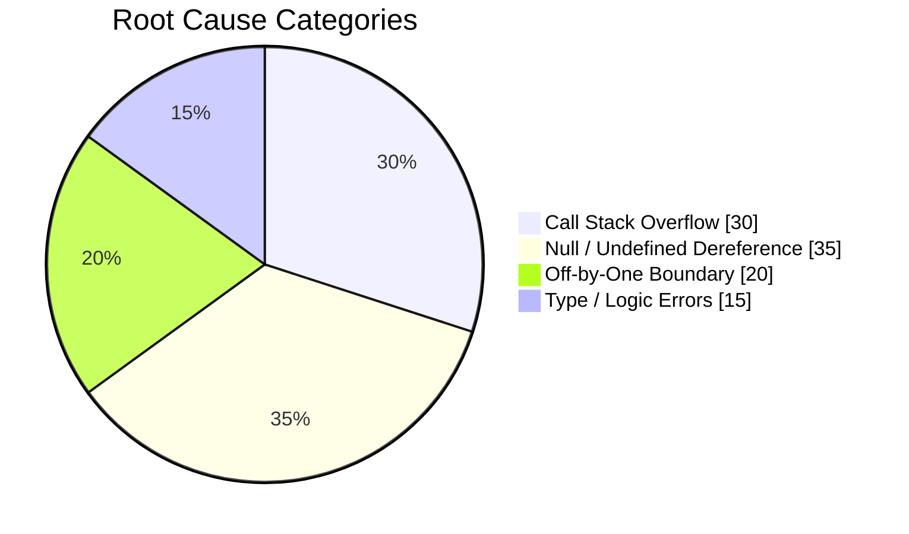
```mermaid
pie showData title Root Cause Categories
    "Call Stack Overflow" : 30
    "Null / Undefined Dereference" : 35
    "Off-by-One Boundary" : 20
    "Type / Logic Errors" : 15
```

### 🔀 Issue Flow: Detection → Resolution (Sankey)

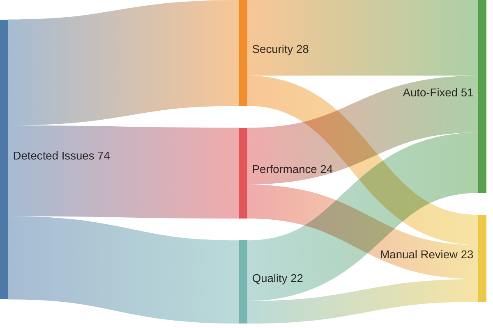
```mermaid
sankey-beta

Detected Issues,Security,28
Detected Issues,Performance,24
Detected Issues,Quality,22
Security,Auto-Fixed,20
Security,Manual Review,8
Performance,Auto-Fixed,15
Performance,Manual Review,9
Quality,Auto-Fixed,16
Quality,Manual Review,6
```

### 🎯 Fix Prioritization Matrix

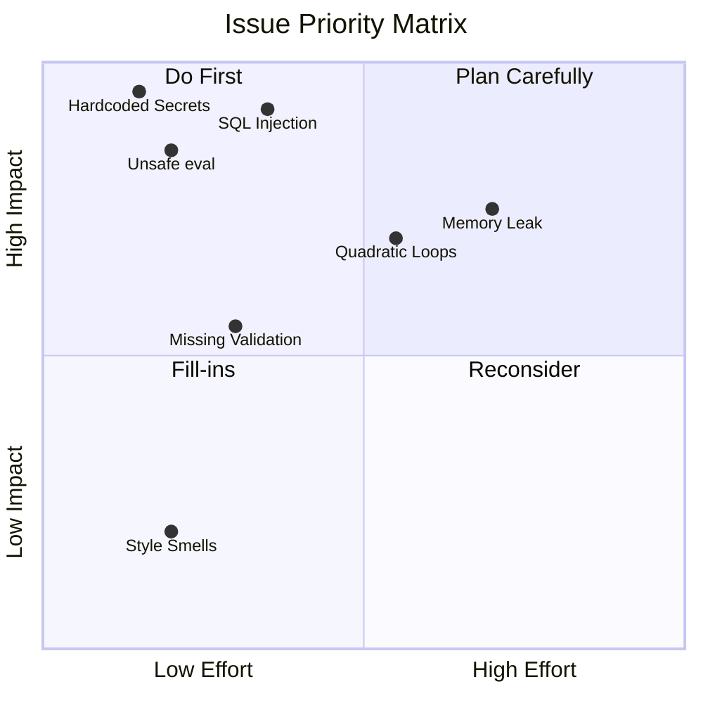
```mermaid
quadrantChart
    title Issue Priority Matrix
    x-axis Low Effort --> High Effort
    y-axis Low Impact --> High Impact
    quadrant-1 Plan Carefully
    quadrant-2 Do First
    quadrant-3 Fill-ins
    quadrant-4 Reconsider
    Hardcoded Secrets: [0.15, 0.95]
    SQL Injection: [0.35, 0.92]
    Unsafe eval: [0.2, 0.85]
    Quadratic Loops: [0.55, 0.7]
    Memory Leak: [0.7, 0.75]
    Missing Validation: [0.3, 0.55]
    Style Smells: [0.2, 0.2]
```

### 🧭 Developer Experience Journey

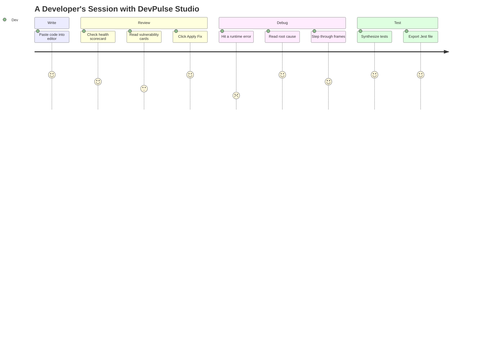
```mermaid
journey
    title A Developer's Session with DevPulse Studio
    section Write
      Paste code into editor: 5: Dev
    section Review
      Check health scorecard: 4: Dev
      Read vulnerability cards: 3: Dev
      Click Apply Fix: 5: Dev
    section Debug
      Hit a runtime error: 2: Dev
      Read root cause: 5: Dev
      Step through frames: 4: Dev
    section Test
      Synthesize tests: 5: Dev
      Export Jest file: 5: Dev
```

### 🗓 Feature Delivery Timeline

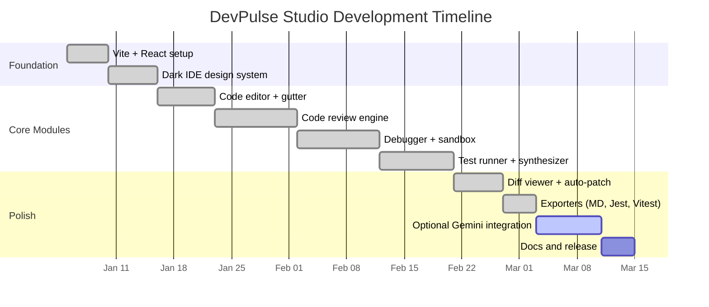
```mermaid
gantt
    title DevPulse Studio Development Timeline
    dateFormat  YYYY-MM-DD
    axisFormat  %b %d
    section Foundation
    Vite + React setup           :done,    f1, 2026-01-05, 5d
    Dark IDE design system       :done,    f2, after f1, 6d
    section Core Modules
    Code editor + gutter         :done,    c1, after f2, 7d
    Code review engine           :done,    c2, after c1, 10d
    Debugger + sandbox           :done,    c3, after c2, 10d
    Test runner + synthesizer    :done,    c4, after c3, 9d
    section Polish
    Diff viewer + auto-patch     :done,    p1, after c4, 6d
    Exporters (MD, Jest, Vitest) :done,    p2, after p1, 4d
    Optional Gemini integration  :active,  p3, after p2, 8d
    Docs and release             :         p4, after p3, 4d
```

> 📝 *Dates in the Gantt chart are placeholders. Edit them to match your real project history.*

### 🗃 Data Model (Entity Relationship)

```mermaid
erDiagram
    SESSION ||--o{ REVIEW : contains
    SESSION ||--o{ DEBUG_RUN : contains
    SESSION ||--o{ TEST_SUITE : contains
    REVIEW ||--|{ ISSUE : reports
    DEBUG_RUN ||--o{ FRAME : records
    TEST_SUITE ||--|{ TEST_CASE : includes

    SESSION {
        string id
        text code
        datetime createdAt
    }
    REVIEW {
        string grade
        int securityScore
        int performanceIndex
        int qualityScore
    }
    ISSUE {
        string type
        string severity
        int line
        string suggestedFix
    }
    DEBUG_RUN {
        string errorType
        string rootCause
        int latencyMs
    }
    FRAME {
        int step
        json variables
    }
    TEST_SUITE {
        string name
        int passed
        int failed
    }
    TEST_CASE {
        string category
        json args
        json expected
        string status
    }
```

### 🛡 Vulnerability Severity Reference

| Issue Type | Severity | Typical Impact | Auto-Fix |
|:--|:--:|:--|:--:|
| Hardcoded secrets | 🔴 Critical | Credential leakage | ✅ |
| SQL injection | 🔴 Critical | Data breach | ✅ |
| Unsafe `eval()` | 🔴 Critical | Remote code execution | ✅ |
| Unhandled recursion | 🟠 High | Stack overflow crash | ✅ |
| Memory leaks | 🟠 High | Degraded performance | ⚠️ Partial |
| `O(N²)` nested loops | 🟡 Medium | Slow on large input | ✅ |
| Missing input validation | 🟡 Medium | Unexpected behaviour | ✅ |
| Style / code smells | 🟢 Low | Maintainability | ✅ |

### 🔤 Letter Grade Scale

| Grade | Score Range | Meaning |
|:--:|:--:|:--|
| 🟢 **A+ / A** | 90 to 100 | Production ready |
| 🟢 **B** | 80 to 89 | Good, minor improvements |
| 🟡 **C** | 70 to 79 | Acceptable, needs attention |
| 🟠 **D** | 60 to 69 | Risky, fix before shipping |
| 🔴 **F** | below 60 | Critical problems found |

---

## 📁 Project Structure

```text
Code_Testing_And_Debugging_Platform/
├── 📂 public/              # Static assets served as-is
├── 📂 src/                 # React application source
│   └── ...                 # Components, engines, styles
├── 📄 index.html           # Vite entry HTML
├── 📄 package.json         # Dependencies and npm scripts
├── 📄 package-lock.json    # Locked dependency tree
├── 📄 vite.config.js       # Vite configuration
├── 📄 .oxlintrc.json       # Oxlint rules
├── 📄 .gitignore           # Git ignore rules
└── 📄 README.md            # You are here
```

```mermaid
flowchart LR
    I[index.html] --> M[src entry]
    M --> APP[App Component]
    APP --> UI[UI Modules]
    APP --> EN[Analysis Engines]
    V[vite.config.js] -. builds .-> I
    P[package.json] -. deps .-> V
    PUB[public/] -. static .-> I
```

---

## 🚀 Getting Started

### Prerequisites

| Requirement | Version |
|:--|:--|
| 🟢 Node.js | `v18` or higher |
| 📦 npm or yarn | latest |

### Installation

```bash
# 1. Clone the repository
git clone https://github.com/ashrithBalaji456/Code_Testing_And_Debugging_Platform.git

# 2. Navigate into the project
cd Code_Testing_And_Debugging_Platform

# 3. Install dependencies
npm install

# 4. Start the development server
npm run dev
```

Open **<http://localhost:5173>** in your browser and start using DevPulse Studio! 🎉

```mermaid
flowchart LR
    A[git clone] --> B[cd project]
    B --> C[npm install]
    C --> D[npm run dev]
    D --> E([🌐 localhost:5173])
    style E fill:#00c853,color:#fff
```

---

## 📖 Usage Guide

<details>
<summary><b>🔍 Reviewing code</b></summary>

1. Paste or write code in the **editor**.
2. Open the **Review Hub** and read your letter grade and scores.
3. Browse the issue cards, then click **Apply Fix** on any card to patch it.
4. Click **Export** to download the Markdown report.

</details>

<details>
<summary><b>🐞 Debugging code</b></summary>

1. Click **Run** to execute the code in the sandbox.
2. If an error is trapped, read the **root cause** explanation.
3. Use the **step simulator** (back, forward, auto-play) and watch variable changes.
4. Apply the suggested remediation and run again.

</details>

<details>
<summary><b>🧪 Testing code</b></summary>

1. Open the **Test Suite** tab.
2. Click **Synthesize Tests** to auto-generate happy-path, boundary and edge cases.
3. Add your own with the **Custom Test Builder**.
4. Watch the **live runner** for pass/fail and latency, then export to **Jest / Vitest**.

</details>

<details>
<summary><b>🔀 Applying all fixes via Diff</b></summary>

1. Open the **Diff Viewer** to compare original and refactored code.
2. Click **Apply All Fixes** to replace the editor contents with the secured version.

</details>

---

## 📜 Available Scripts

| Command | Description |
|:--|:--|
| `npm run dev` | Start the Vite dev server with hot reload |
| `npm run build` | Create an optimized production build |
| `npm run preview` | Preview the production build locally |

> Check `package.json` for the full, up-to-date script list (including any lint script).

---

## ⚙ Configuration (Optional Gemini AI)

DevPulse Studio works fully offline with its built-in heuristic engine. To enable optional **Gemini AI** enhancements, supply your own API key through an environment variable, for example in a `.env.local` file at the project root:

```bash
VITE_GEMINI_API_KEY=your_api_key_here
```

> ⚠️ **Never commit API keys.** `.env.local` should stay in `.gitignore`. Check the source for the exact variable name your build expects.

```mermaid
flowchart LR
    A[Code Submitted] --> B{Gemini key set?}
    B -->|No| C[Static Heuristic Engine]
    B -->|Yes| D[Heuristic Engine + Gemini AI]
    C --> E[Results]
    D --> E
```

---

## 🗺 Roadmap

- [x] Code editor with gutter markers
- [x] Health scorecard and letter grading
- [x] Vulnerability and smell detection
- [x] One-click Apply Fix
- [x] Smart debugger with root cause analysis
- [x] Variable watch and step simulator
- [x] Test synthesizer and live runner
- [x] Jest / Vitest export
- [x] Side-by-side diff viewer
- [ ] Multi-language support (Python, Java, TypeScript)
- [ ] Persistent session history
- [ ] Shareable review links
- [ ] GitHub Actions / CI integration
- [ ] Code coverage visualization
- [ ] Plugin system for custom rules

```mermaid
timeline
    title Product Roadmap
    Phase 1 - Core : Editor : Review Hub : Debugger : Test Suite
    Phase 2 - Intelligence : Gemini AI integration : Smarter test synthesis
    Phase 3 - Scale : Multi-language : Session history : Shareable reports
    Phase 4 - Ecosystem : CI integration : Plugin system : Coverage charts
```

---

## 🤝 Contributing

Contributions are welcome! 🎉

```mermaid
flowchart LR
    A[🍴 Fork] --> B[🌿 Create Branch]
    B --> C[💻 Make Changes]
    C --> D[✅ Test Locally]
    D --> E[📤 Push]
    E --> F[🔀 Open Pull Request]
    F --> G{Review}
    G -->|Approved| H([🎉 Merged])
    G -->|Changes| C
    style H fill:#00c853,color:#fff
```

```bash
# Fork, then:
git checkout -b feature/amazing-feature
git commit -m "feat: add amazing feature"
git push origin feature/amazing-feature
# Open a Pull Request on GitHub
```

**Commit style:** `feat:` new feature • `fix:` bug fix • `docs:` documentation • `refactor:` code cleanup • `test:` tests

---

## ❓ FAQ

<details>
<summary><b>Does my code leave my browser?</b></summary>
By default, no. Review, debugging and testing run locally in your browser. Only if you enable the optional Gemini integration would code be sent to that service.
</details>

<details>
<summary><b>Which languages are supported?</b></summary>
The in-browser sandbox and test runner currently target JavaScript.
</details>

<details>
<summary><b>Is the sandbox really safe?</b></summary>
It is designed to isolate evaluation and trap errors, but as with any in-browser execution, avoid running untrusted code you do not understand.
</details>

---

## 📄 License & Author

<div align="center">

**Author:** [@ashrithBalaji456](https://github.com/ashrithBalaji456)

> Add a `LICENSE` file (e.g. MIT) to the repo and update this section accordingly.

<br/>

⭐ **If you find DevPulse Studio useful, please star the repo!** ⭐

<a href="https://github.com/ashrithBalaji456/Code_Testing_And_Debugging_Platform/stargazers">
  
</a>
<a href="https://github.com/ashrithBalaji456/Code_Testing_And_Debugging_Platform/fork">
  
</a>

<br/><br/>


*Made with ❤️ for developers who ship clean code.*

</div>
